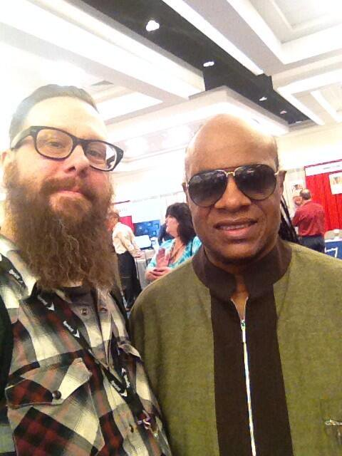
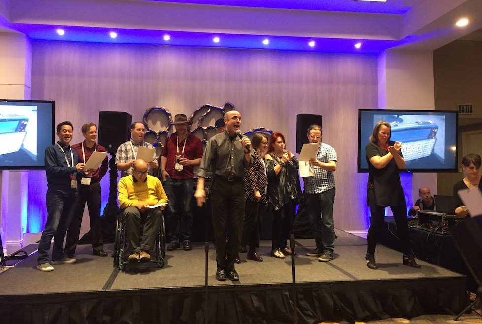

# CSUN 2017

http://csunconference.org/

Presentation: https://nschonni.github.io/presentations/2017/04/26/

## What is CSUN?

## Information for first timers
- web-ally.slack.com #csunatc17 room
- John Foliot's guide http://john.foliot.ca/csun-for-newbies/
- Paul J. Adam's guide http://pauljadam.com/blog/2015/03/02/csun-2015-tips-tricks-csun15-survival-list/

## Who goes to CSUN?

### People you'll see
- Students
- Civil Servants
- Political office holders
- W3C staff
- Higher education staff and teachers
- UX designers
- Developers
- Testers
- Accessibility auditors
- People with disabilities (Low or No vision, Deaf, Deaf/Blink, Cognitive disabilities)

### Stevie Wonder

You'll probably run into him at some point of the conference

### Software
- Microsoft
- Google
- Facebook
- Oracle

### Telecom
- ATT
- Comcast

### Retail companies
- Starbucks
- Target

### Publishers
- Pearson
- Adobe

## What is there

### Pre-conference workshops
Before the actual conference, CSUN now offers 2 days of [Pre-conference workshops](http://www.csun.edu/cod/conference/2017/sessions/index.php/public/conf_sessions/view_preconference).
- [Resources from the Inclusive Design Fundamentals workshop](https://isner.github.io/inclusive-design-fundamentals/) by Dennis Lembrée, Caitlin Geier, and Matthew Isner.
- [Mobile Pre-Conference Accessibility Workshops(http://pauljadam.com/csunmobile/) by Paul Adam
- Introduction to Assistive Technology by Laura Simmons-Martinez and Bernadette Kennard
- Achieving Authentic Communication with AAC: an Implementation Toolkit by Belva Holman
- Supporting Students with Complex Communication Needs in Today's Classrooms by Kelly Fonner

### Keynote
The keynote occurs the Tuesday before the conference kicks off. This year

- Strache Leadership Award

### Exhibitors hall
https://www.csun.edu/cod/conference/2017/rebooking/index.php/public/exhibitors/

### Showcase suites
http://www.csun.edu/cod/conference/2017/sessions/index.php/public/website_pages/view/16

#### SSB BART Group
For two decades, SSB BART Group has provided digital accessibility compliance solutions for thousands of organizations in the private and public sectors. SSB’s solutions ensure conformity with relevant laws, standards and guidelines, including the ADA, WCAG, CVAA, AODA, and Mandate 376, as well as Section 504 and 508 requirements. With a comprehensive suite of products and services designed to support effective, long-term accessibility programs, SSB helps clients address the full scope of accessible technology regulations with software, consulting and training to ensure compliance in desktop, mobile and electronic document systems.

SSB is pleased to offer a wide variety of session topics at this year’s conference, including laws and standards updates for Section 508, the ADA, CVAA, and ACAA, accessibility testing, accessible development, ARIA, gaming accessibility, accessibility trends, and more!

#### Freedom Scientific
You probably know them as the company that produces JAWS. They have now merged
with a few companies to form VFO, which includes Ai Squared

www.freedomscientific.com

We are proud to support the CSUN Assistive Technology Conference again in 2017! Join us in our showcase suite, Seaport B, where top industry professionals will share information and experience through their presentations. For a complete session schedule, please visit our events page at www.freedomscientific.com. Our participation also extends to the exhibit hall, where we invite you to join us for demonstrations, product information, giveaways, and more - booths 205, 305, and 405.

#### Amazon
www.amazon.com

Amazon is happy to return to CSUN, this year as a Showcase sponsor. We will have presentations and "play sessions" in our Showcase Suite located in Seaport Ballroom C starting at 10am each day.

Also visit us at our side-by-side Exhibit Booths 420 & 422 located towards the back of the Exhibit Hall.

Both the Exhibit Booths and Showcase Suite will allow for opportunities to try products for yourself. Members of Amazon's Accessibility team will be available to listen to your feedback and answer questions about our product's Accessibility features.

We invite you to join us in Seaport Ballroom C at 10 am on Wednesday, March 1st for our "Amazon @ CSUN" introductory session which includes additional details of how you can connect with Amazon at CSUN to learn about Alexa, Fire TV, Kindle, Amazon Video, Education, Games, and more.

#### Deque Systems

www.deque.com

Deque Systems, founded in 1999, is a leading provider of digital accessibility software and services. Our product family includes the uniquely robust suite of WorldSpace accessibility testing tools, Amaze, and aXe: our open source accessibility rules library. Deque's expert team consists of mission-driven thought leaders and innovators in accessibility and software development who work alongside our clients to help make meaningful progress towards digital equality. Deque was awarded the Computerworld 21st Century Achievement Award for Innovation for the Amaze technology, and the company is frequently recognized in the Inc. 5000 List of America’s Fastest Growing Companies. Learn more at www.deque.com.

#### Google Inc.

www.google.com

Join Google's accessibility and engineering teams in our Showcase Suite in Seaport Ballroom "G" for general session presentations on a range of topics, with product spotlights on Android, Chrome, G Suite apps, Liftware, YouTube, Google Home, and more. For a full list of our sessions, check the CSUN Conference program schedule. For more information on Google’s mission to make the world’s information universally accessible and useful, visit the Google Accessibility website. Come visit us in our Exhibit Booth #713 for demos and even more information!

#### Microsoft

www.microsoft.com

Join Microsoft experts in our Showcase Suite in Harbor Ballroom "H" for presentations on a range of topics, with product spotlights on Office 365, Skype, One Note and more! Microsoft is committed to creating and delivering technology that empowers people of all abilities. Stop by our Exhibit Booth #213 to learn about inclusive hiring, updates to Windows 10, the accessibility of Office 365, get help from our onsite technical experts or stay for one of our short 10 minute demos.

### Post-conference hackathon
For the last few years Deque has sponsored a hackathon on the Saturday following
CSUN. It's a good

## Sessions
http://www.csun.edu/cod/conference/2017/sessions/index.php/public/conf_sessions/
The sessions at CSUN are split up into tracks
- Education
- Employment and Workplace
- Entertainment
- Independent Living
- Law and Policy
- Transportation

### Navigating the sessions
The session guide can be hard to use, so people have usually tried to scrape the
site and give alternate formats like https://docs.google.com/spreadsheets/d/1GSsYZ8A7dr0PJTS3-j4RK1a-H78_u4L0caq1vbXNQhk/edit#gid=163653407
In past years I've created Guidebook apps to help myself and others.

### Notable sessions
- Viking and Lumberjack live show
- Lainey Feingold's legal update
- 508 Refresh update from ADA
- Any of Jamie Knight's talks
- Web Content Accessibility Guidelines 2.1 First Public Working Draft http://www.w3.org/TR/WCAG21/

### Some sessions I attended
- Static vs. Interactive Widget Roles (Bryan Garaventa) https://www.linkedin.com/pulse/csun-2017-printout-static-vs-interactive-widget-roles-bryan-garaventa-

### Recaps (FOMO)
- Dennis Deacon did a mega list of available presentations http://www.dennisdeacon.com/web-design/accessibility/csun-2017-megalist-presentation-resources-digital-professionals/
- WebAxe recap http://www.webaxe.org/csun17-review/

## Parties

### Sign language karaoke

You'll see many A11y people belting out their favourite hits, like Ottawa's own
David McDonald. Image from Dennis Lembree's Flickr

### Google party
Invite only, held across the street from the conference venue

### SSB Bart Group party

### Role=drinks
https://www.roledrinks.com/

## Travel and accommodations

### Hotels
Hotels in San Diego aren't cheap.

### Flights
There are 2 daily direct flights from Toronto to San Diego which is probably the
easiest way to get down. As long as you book enough in advance, it will probably
cost you around $450-650CAD.

### My "interesting" trip down

### Food

### Cellphones

## Next year (33rd CSUN Conference)
Call for Papers Dates:
- Science/Research Journal Track: August 24, 2017 - September 12, 2017
- General Sessions Track: September 14, 2017 - October 3, 2017

Marcy Sutton wrote a good piece on submitting papers https://marcysutton.com/writing-winning-talk-abstracts/

### When
March 19 to March 23, 2018

### Where
Manchester Grand Hyatt Hotel
San Diego, CA 92101

## Questions?

Thank you!
